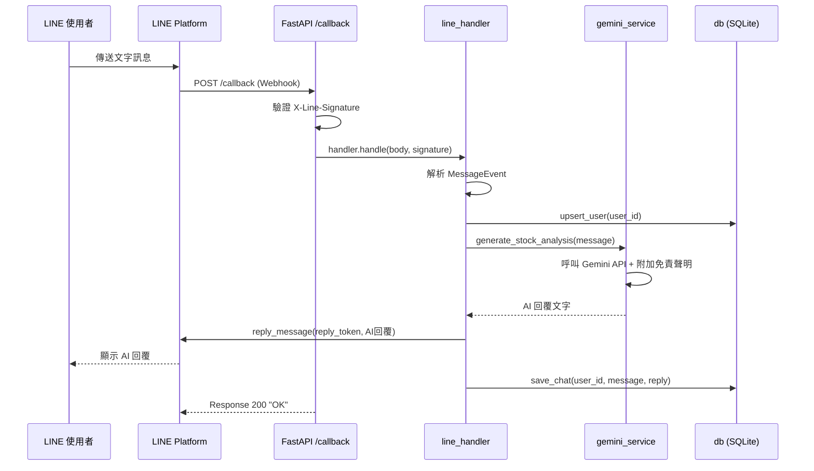
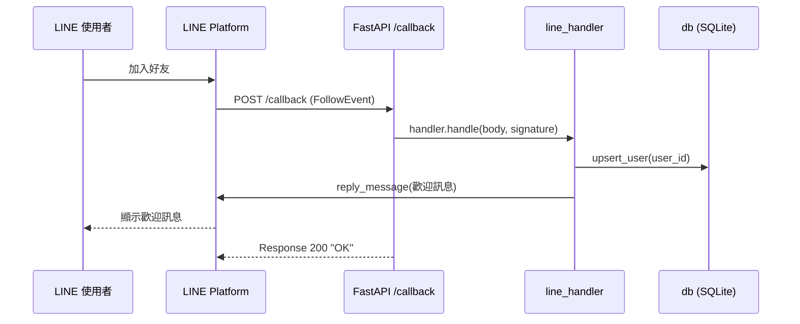
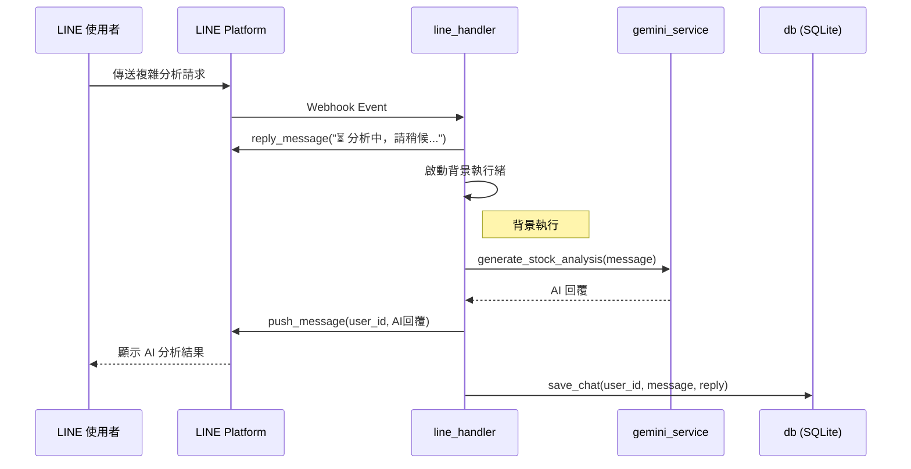
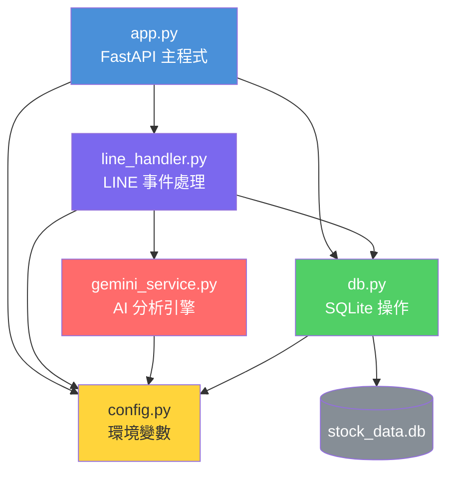

# 🏗️ 股票 LINE Bot — 系統架構文件

## 文件資訊

| 項目 | 內容 |
|------|------|
| 專案名稱 | Stock AI LINE Bot（股票智慧助手） |
| 版本 | v1.0 |
| 建立日期 | 2026-05-05 |
| 關聯文件 | [PRD.md](./PRD.md) |

---

## 1. 系統總覽

### 1.1 架構風格

採用 **單體式應用（Monolithic）** 架構，以 FastAPI 作為 Webhook 伺服器。所有模組（LINE 訊息處理、AI 生成、資料庫存取）運行在同一個 Python 行程中，適合 MVP 階段快速開發與部署。

### 1.2 高層架構圖

```
                          ┌─────────────────────────────────────────────┐
                          │              FastAPI Application            │
                          │                                             │
┌──────────┐   HTTPS/POST │  ┌───────────┐   ┌──────────────────────┐  │   HTTPS
│          │ ────────────▶│  │  Webhook   │──▶│  LINE Message        │  │──────────▶ ┌──────────────┐
│   LINE   │              │  │  Router    │   │  Handler             │  │            │ LINE Platform│
│ Platform │ ◀────────────│  │ /callback  │   │ (WebhookHandler v3)  │  │◀────────── │ Messaging API│
│          │   reply/push │  └───────────┘   └──────────┬───────────┘  │   reply    └──────────────┘
└──────────┘              │                             │              │
                          │                    ┌────────▼────────┐     │
                          │                    │  Gemini Service │     │   HTTPS
                          │                    │  (AI 分析引擎)   │─────│──────────▶ ┌──────────────┐
                          │                    └────────┬────────┘     │            │ Google       │
                          │                             │              │            │ Gemini API   │
                          │                    ┌────────▼────────┐     │            └──────────────┘
                          │                    │   DB Service    │     │
                          │                    │  (SQLite 存取)  │     │
                          │                    └────────┬────────┘     │
                          │                             │              │
                          └─────────────────────────────│──────────────┘
                                                        │ Read/Write
                                                 ┌──────▼──────┐
                                                 │  SQLite DB  │
                                                 │ stock_data  │
                                                 │   .db       │
                                                 └─────────────┘
```

---

## 2. 技術選型

| 層級 | 技術 | 版本 | 選型理由 |
|------|------|------|---------|
| 語言 | Python | >= 3.10 | LINE SDK v3 最低需求 |
| Web 框架 | **FastAPI** | latest | 原生 async 支援、自動 API 文件、型別提示友善 |
| ASGI Server | Uvicorn | latest | FastAPI 標準搭配的高效能 ASGI 伺服器 |
| LINE SDK | line-bot-sdk-python **v3** | latest | 官方 SDK，使用 `linebot.v3` 模組 |
| AI 引擎 | Google Gemini API | `google-genai` | Google 最新生成式 AI |
| 資料庫 | SQLite + `aiosqlite` | 內建 | 輕量、零設定、支援 async |
| 環境管理 | python-dotenv | latest | `.env` 管理敏感資訊 |
| 開發工具 | ngrok | latest | 本地開發 HTTPS 隧道 |

### 為什麼選 FastAPI 而非 Flask？

| 比較項目 | Flask | FastAPI |
|---------|-------|---------|
| 非同步支援 | 需額外設定 | **原生 async/await** |
| 型別檢查 | 無 | **Pydantic 自動驗證** |
| API 文件 | 需 Swagger 外掛 | **自動產生 /docs** |
| 效能 | WSGI（同步） | **ASGI（非同步，高並發）** |
| Gemini API 呼叫 | 阻塞主線程 | **可非同步呼叫，不阻塞** |

---

## 3. 模組劃分

### 3.1 模組總覽

```
stock-line-bot/
├── .env                        # 環境變數（⚠️ 加入 .gitignore）
├── .gitignore
├── requirements.txt
├── docs/
│   ├── PRD.md                  # 產品需求規格書
│   └── ARCHITECTURE.md         # 本文件
├── app.py                      # 🔹 主程式：FastAPI + Webhook 路由
├── line_handler.py             # 🔹 LINE 事件處理器
├── gemini_service.py           # 🔹 Gemini AI 服務
├── db.py                       # 🔹 SQLite 資料庫操作
├── config.py                   # 🔹 環境變數集中管理
├── stock_data.db               # SQLite 檔案（自動產生）
└── README.md
```

### 3.2 各模組職責

#### `config.py` — 設定管理

```python
"""
職責：集中管理所有環境變數與設定常數。
其他模組統一從此處 import 設定，避免散落各處。
"""
import os
from dotenv import load_dotenv

load_dotenv()

# LINE Bot
LINE_CHANNEL_SECRET = os.environ["LINE_CHANNEL_SECRET"]
LINE_CHANNEL_ACCESS_TOKEN = os.environ["LINE_CHANNEL_ACCESS_TOKEN"]

# Gemini
GEMINI_API_KEY = os.environ["GEMINI_API_KEY"]
GEMINI_MODEL = "gemini-2.0-flash"

# Database
DB_PATH = "stock_data.db"
```

#### `app.py` — FastAPI 主程式 + Webhook 路由

```python
"""
職責：
1. 建立 FastAPI 應用實例
2. 定義 /callback Webhook 端點
3. 啟動時初始化資料庫
4. 將 Webhook body 交給 line_handler 處理
"""
```

**關鍵設計：**
- 使用 FastAPI `lifespan` 在啟動時自動建立 SQLite 表
- `/callback` 端點接收 LINE Webhook，驗證簽名後交給 `WebhookHandler`
- 回傳 `"OK"` 確保 LINE Platform 不重試

#### `line_handler.py` — LINE 事件處理器

```python
"""
職責：
1. 初始化 WebhookHandler（linebot.v3）
2. 註冊各事件 handler（MessageEvent、FollowEvent 等）
3. 協調 gemini_service 與 db 模組完成回覆與紀錄
"""
```

**處理的事件：**

| 事件 | Handler 函式 | 動作 |
|------|-------------|------|
| `MessageEvent` + `TextMessageContent` | `handle_text_message()` | AI 分析 → 回覆 → 存 DB |
| `MessageEvent` + 其他 | `handle_non_text_message()` | 回覆提示文字 |
| `FollowEvent` | `handle_follow()` | 歡迎訊息 + 建立使用者 |
| `UnfollowEvent` | `handle_unfollow()` | 記錄 log |

#### `gemini_service.py` — Gemini AI 服務

```python
"""
職責：
1. 初始化 Gemini Client
2. 管理 System Prompt
3. 提供 generate_stock_analysis(user_message) 方法
4. 處理 API 錯誤與 fallback
"""
```

**核心方法：**

| 方法 | 輸入 | 輸出 | 說明 |
|------|------|------|------|
| `generate_stock_analysis(message)` | 使用者文字 | AI 回覆字串 | 呼叫 Gemini API，附加免責聲明 |

#### `db.py` — SQLite 資料庫操作

```python
"""
職責：
1. 初始化資料庫、自動建表
2. 提供 CRUD 操作方法
3. 管理 DB 連線（使用 aiosqlite 或 threading.Lock）
"""
```

**核心方法：**

| 方法 | 說明 |
|------|------|
| `init_db()` | 建立 `users` 與 `chat_history` 表 |
| `upsert_user(user_id, display_name)` | 新增或更新使用者（INSERT OR IGNORE + UPDATE） |
| `save_chat(user_id, user_message, bot_reply)` | 寫入聊天紀錄 |
| `get_chat_history(user_id, limit)` | 查詢使用者歷史紀錄 |

---

## 4. 資料流

### 4.1 核心資料流：使用者傳送文字訊息



### 4.2 加入好友流程



### 4.3 耗時操作的背景處理流程

當 Gemini API 回覆可能超時時，採用「先回覆，再推送」策略：



---

## 5. Webhook 處理流程（詳細）

### 5.1 請求處理管線

```
LINE Platform
    │
    │ POST /callback
    │ Headers: X-Line-Signature
    │ Body: JSON (webhook events)
    │
    ▼
┌─────────────────────────────────────────────┐
│ Step 1: FastAPI 路由 (/callback)             │
│   - 讀取 X-Line-Signature header            │
│   - 讀取 request body (raw text)             │
│   - 呼叫 handler.handle(body, signature)     │
└──────────────────┬──────────────────────────┘
                   │
                   ▼
┌─────────────────────────────────────────────┐
│ Step 2: WebhookHandler 簽名驗證              │
│   - 用 Channel Secret 計算 HMAC-SHA256       │
│   - 比對 X-Line-Signature                   │
│   - ❌ 不符 → InvalidSignatureError → 400    │
│   - ✅ 通過 → 解析事件                       │
└──────────────────┬──────────────────────────┘
                   │
                   ▼
┌─────────────────────────────────────────────┐
│ Step 3: 事件分發                              │
│   - MessageEvent + TextMessageContent        │
│     → handle_text_message()                  │
│   - MessageEvent + 其他                       │
│     → handle_non_text_message()              │
│   - FollowEvent                              │
│     → handle_follow()                        │
│   - UnfollowEvent                            │
│     → handle_unfollow()                      │
│   - 其他事件 → 忽略                           │
└──────────────────┬──────────────────────────┘
                   │
                   ▼
┌─────────────────────────────────────────────┐
│ Step 4: 業務邏輯處理                          │
│   a) upsert_user → SQLite                   │
│   b) gemini_service.generate_stock_analysis  │
│   c) reply_message / push_message            │
│   d) save_chat → SQLite                     │
└──────────────────┬──────────────────────────┘
                   │
                   ▼
           Response 200 "OK"
```

### 5.2 `/callback` 端點實作（FastAPI + line-bot-sdk v3）

```python
from fastapi import FastAPI, Request, HTTPException
from contextlib import asynccontextmanager

from linebot.v3 import WebhookHandler
from linebot.v3.exceptions import InvalidSignatureError
from linebot.v3.messaging import (
    Configuration, ApiClient, MessagingApi,
    ReplyMessageRequest, TextMessage,
)
from linebot.v3.webhooks import (
    MessageEvent, TextMessageContent, FollowEvent,
)

from config import LINE_CHANNEL_SECRET, LINE_CHANNEL_ACCESS_TOKEN
from db import init_db


@asynccontextmanager
async def lifespan(app: FastAPI):
    """應用啟動時初始化資料庫"""
    init_db()
    yield


app = FastAPI(lifespan=lifespan)
configuration = Configuration(access_token=LINE_CHANNEL_ACCESS_TOKEN)
handler = WebhookHandler(LINE_CHANNEL_SECRET)


@app.post("/callback")
async def callback(request: Request):
    signature = request.headers.get("X-Line-Signature", "")
    body = (await request.body()).decode("utf-8")

    try:
        handler.handle(body, signature)
    except InvalidSignatureError:
        raise HTTPException(status_code=400, detail="Invalid signature")

    return "OK"
```

---

## 6. 資料庫設計

### 6.1 ER Diagram

```mermaid
erDiagram
    USERS {
        INTEGER id PK "自增主鍵"
        TEXT user_id UK "LINE userId"
        TEXT display_name "顯示名稱"
        TIMESTAMP created_at "首次互動"
        TIMESTAMP last_active_at "最後互動"
    }

    CHAT_HISTORY {
        INTEGER id PK "自增主鍵"
        TEXT user_id FK "LINE userId"
        TEXT user_message "使用者訊息"
        TEXT bot_reply "Bot 回覆"
        TIMESTAMP created_at "訊息時間"
    }

    USERS ||--o{ CHAT_HISTORY : "has many"
```



### 6.2 SQLite 設定建議

```python
import sqlite3

# 啟用 WAL 模式，提高並發讀寫效能
conn = sqlite3.connect("stock_data.db")
conn.execute("PRAGMA journal_mode=WAL;")
conn.execute("PRAGMA foreign_keys=ON;")
```

---

## 7. 模組依賴關係



**依賴方向：** `app.py` → `line_handler.py` → `gemini_service.py` / `db.py` → `config.py`

所有模組共用 `config.py` 取得設定，避免環境變數散落各處。

---

## 8. 錯誤處理策略

| 錯誤場景 | 處理方式 | 使用者看到的訊息 |
|---------|---------|----------------|
| Webhook 簽名驗證失敗 | 回傳 HTTP 400 | （無回覆） |
| Gemini API 呼叫失敗 | 捕獲 Exception，記錄 log | 「🔧 系統忙碌中，請稍後再試」 |
| Gemini API 超時 (>10s) | 先 reply 處理中，背景 push 結果 | 「⏳ 分析中，請稍候...」 |
| Reply Token 過期 | 改用 push_message | （自動 fallback） |
| SQLite 寫入失敗 | 記錄 error log，不影響回覆 | （使用者無感） |
| 非文字訊息 | 回覆提示訊息 | 「📝 目前僅支援文字查詢喔」 |
| 重複 Webhook (redelivery) | 檢查 `is_redelivery`，跳過已處理 | （不重複回覆） |

---

## 9. 安全性設計

### 9.1 敏感資訊保護

```
.env                           ← 存放 Token / Secret / API Key
 │                               ⚠️ 絕對不進版控
 │
 ├── LINE_CHANNEL_SECRET       ← Webhook 簽名驗證用
 ├── LINE_CHANNEL_ACCESS_TOKEN ← 呼叫 Messaging API 用
 └── GEMINI_API_KEY            ← 呼叫 Gemini API 用

config.py                      ← 統一讀取，其他模組 import config 使用
```

### 9.2 `.gitignore` 必要項目

```gitignore
# 敏感資訊
.env

# 資料庫
*.db

# Python
__pycache__/
*.pyc
.venv/
```

### 9.3 Webhook 安全

- 每個 Webhook 請求必須通過 `X-Line-Signature` HMAC-SHA256 驗證
- 驗證由 `WebhookHandler` 內建處理，不需手動實作
- 驗證失敗直接回傳 HTTP 400，不執行任何業務邏輯

---

## 10. 部署架構

### 10.1 開發環境

```
開發者電腦
┌────────────────────────────┐
│  uvicorn app:app --reload  │
│  (localhost:8000)          │
└──────────┬─────────────────┘
           │ localhost:8000
    ┌──────▼──────┐
    │   ngrok     │
    │ (HTTPS 隧道) │
    └──────┬──────┘
           │ https://xxxx.ngrok.io/callback
           ▼
    LINE Platform Webhook
```

**啟動指令：**

```bash
# Terminal 1: 啟動 FastAPI
uvicorn app:app --reload --port 8000

# Terminal 2: 啟動 ngrok
ngrok http 8000
```

### 10.2 正式環境（未來）

```
Google Cloud Run
┌─────────────────────────────┐
│  Docker Container           │
│  ┌───────────────────────┐  │
│  │ uvicorn app:app       │  │
│  │ --host 0.0.0.0        │  │
│  │ --port $PORT           │  │
│  └───────────────────────┘  │
│  stock_data.db (Volume)     │
└─────────────────────────────┘
         ▲
         │ HTTPS
    LINE Platform Webhook
```

---

## 11. 依賴套件清單

```txt
fastapi
uvicorn[standard]
line-bot-sdk
google-genai
python-dotenv
aiosqlite
```

安裝指令：

```bash
pip install fastapi uvicorn[standard] line-bot-sdk google-genai python-dotenv aiosqlite
```
